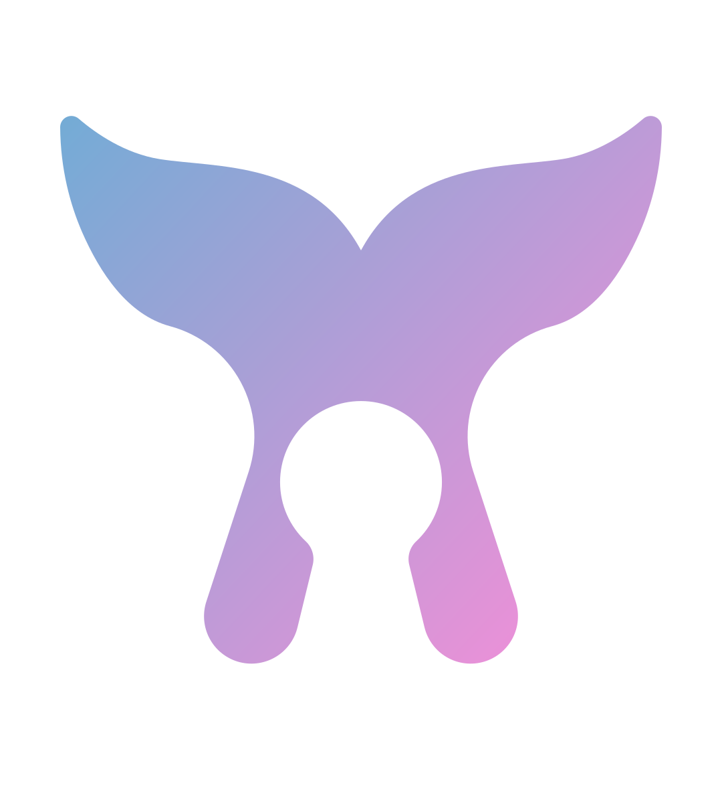
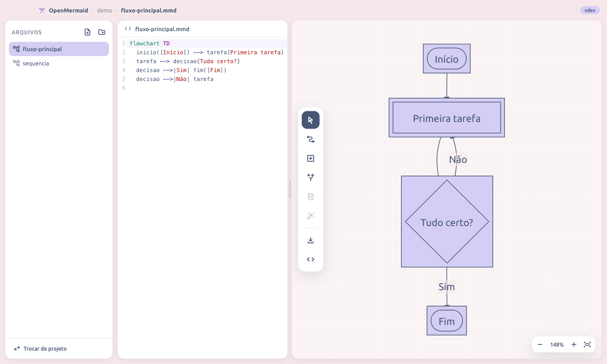

<div align="center">
  

  # OpenMermaid

  **Crie diagramas bonitos sem sair do seu Mac — desenhando no canvas ou escrevendo código [Mermaid](https://mermaid.js.org). 100% offline e de graça.**

  [⬇️ Baixar a última versão](https://github.com/igorvac/openMermaid/releases/latest) · [Reportar um problema](https://github.com/igorvac/openMermaid/issues)

    
</div>



## O que é?

Mermaid é uma linguagem popular para descrever diagramas em texto (fluxogramas, sequências, Gantt…). O OpenMermaid é um aplicativo de desktop que torna isso acessível para qualquer pessoa:

- **Quem não programa** desenha direto no canvas: adiciona caixas, conecta, arrasta, renomeia — e o código Mermaid vai sendo escrito sozinho.
- **Quem programa** digita o código e vê o diagrama se desenhar em tempo real.
- Os dois mundos ficam **sempre sincronizados**: editar de um lado atualiza o outro na hora.

Tudo funciona **offline** — nada sai do seu computador.

## Recursos

| | |
|---|---|
| 🎨 **Edição visual** | Clique para selecionar, duplo-clique para renomear, arraste para reposicionar. 9 formas de nó, conexões com rótulo, cores e direção do fluxo. |
| ⚡ **Tempo real** | Código → diagrama e diagrama → código, instantâneo nos dois sentidos. |
| 📁 **Projetos** | Um projeto é uma pasta comum com arquivos `.mmd` — organize com subpastas, renomeie, duplique. Salvamento automático. |
| 📤 **Exportação** | SVG (vetorial), PNG (alta resolução) e PDF. |
| 🧜‍♀️ **Todos os diagramas Mermaid** | Fluxogramas com edição visual; sequência, classes, ER, Gantt, mindmaps e os demais renderizam ao vivo com edição por texto. |
| 🔒 **Offline e privado** | Sem conta, sem nuvem, sem telemetria. A única conexão é a checagem opcional de novas versões. |
| 🔄 **Atualizações** | O app avisa quando há versão nova e leva você ao download. |

## Instalação

1. Baixe o `.dmg` na [página de releases](https://github.com/igorvac/openMermaid/releases/latest).
2. Abra e arraste o **OpenMermaid** para a pasta **Aplicativos**.
3. **Na primeira abertura**, o macOS bloqueia apps fora da App Store: vá em **Ajustes do Sistema → Privacidade e Segurança** e clique em **"Abrir Assim Mesmo"**. Só precisa uma vez.

> Por que o aviso? O OpenMermaid é um projeto livre e gratuito, sem o certificado pago da Apple (US$ 99/ano). O aviso é padrão para qualquer app não assinado — o código é aberto e você pode auditá-lo aqui mesmo.

## Primeiros passos

1. **Novo projeto** → escolha onde criar a pasta.
2. Um diagrama de exemplo já abre pronto: brinque com ele — arraste as caixas, dê duplo-clique para renomear, use a barra de ferramentas à esquerda do canvas para adicionar formas e conexões.
3. O painel de código (à esquerda) mostra o Mermaid sendo gerado; edite-o quando quiser.
4. Exporte pelo botão ⬇️ da barra de ferramentas ou pelo menu **Arquivo → Exportar**.

**Atalhos úteis**: `⌘N` novo diagrama · `⌘+`/`⌘−`/`⇧⌘0` zoom/ajustar · `⇧⌘L` painel de código · `Delete` excluir seleção · scroll = mover canvas, `⌘`+scroll = zoom.

## Para desenvolvedores

```bash
git clone https://github.com/igorvac/openMermaid.git
cd openMermaid
npm install
npm run dev      # vite + electron com hot reload
npm test         # testes do parser (vitest)
npm run dist     # gera o .dmg em release/
```

Stack: Electron + React + TypeScript, Mermaid 11, CodeMirror 6, Zustand. Pontos de interesse:

- `src/mermaid/` — parser e gerador de código de flowcharts (a ponte entre o canvas e o texto; o código é a fonte da verdade).
- `src/canvas/svgLayout.ts` — drag & drop sobre o SVG do Mermaid: offsets manuais ficam num sidecar `<arquivo>.mmd.layout.json` e as arestas são re-roteadas.
- `electron/` — janela, menu nativo, filesystem via IPC, updater e export de PDF.
- `.github/workflows/release.yml` — cada push na branch `openMermaid` roda os testes, incrementa a versão e publica a release automaticamente.

Abrindo `http://localhost:5180` num navegador comum, um mock em memória substitui o filesystem — útil para mexer só na interface.

### Releases assinadas (opcional)

Com um certificado Apple Developer ID, configure os secrets `CSC_LINK`, `CSC_KEY_PASSWORD`, `APPLE_ID`, `APPLE_APP_SPECIFIC_PASSWORD` e `APPLE_TEAM_ID` no repositório — os builds passam a sair assinados/notarizados e a instalação de atualizações vira um clique, sem o aviso do Gatekeeper.

## Licença

[GPL-3.0-or-later](LICENSE) — software livre: use, estude, modifique e redistribua. Obras derivadas devem permanecer livres.

Feito por **Igor Vac** · diagramas por [Mermaid](https://mermaid.js.org) · fonte [Ubuntu](https://design.ubuntu.com/font) · ícones [Material Symbols](https://fonts.google.com/icons)
